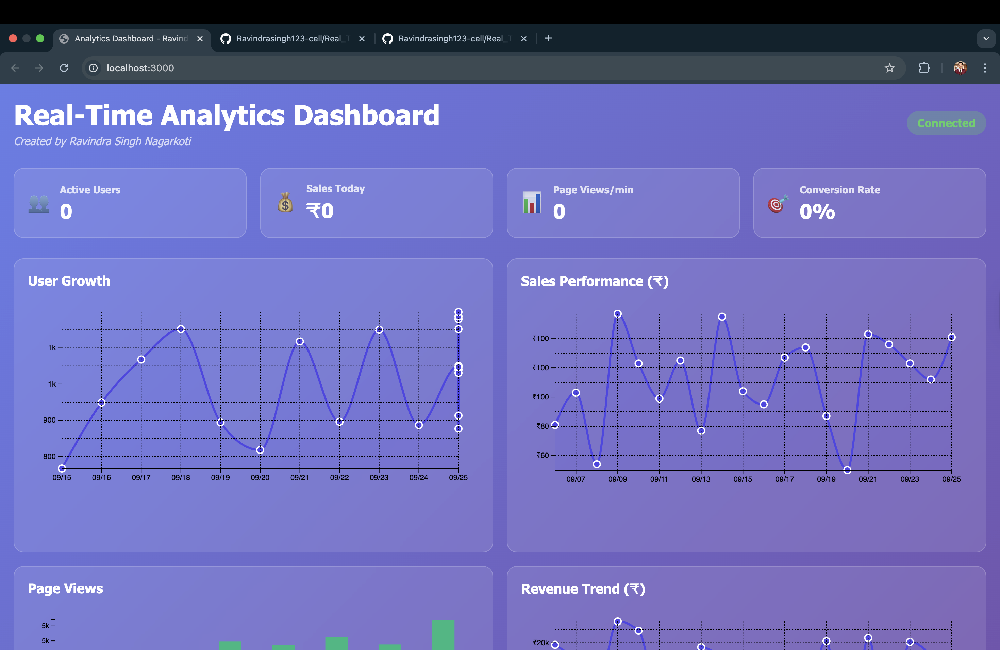

# Real-Time Analytics Dashboard

**Created by: Ravindra Singh Nagarkoti**

A modern, interactive analytics dashboard built with Vue.js, D3.js, and Python Flask. Features real-time data streaming, interactive charts, and responsive design.

## Dashboard Preview



*Real-time analytics dashboard with live data streaming and interactive visualizations*

## Features

- 📊 **Real-time Data Streaming**: Live updates using WebSockets
- 📈 **Interactive Charts**: Line charts, bar charts, and more using D3.js
- 🎨 **Modern UI**: Glassmorphism design with responsive layout
- 📱 **Mobile Friendly**: Responsive design that works on all devices
- ⚡ **Fast Performance**: Optimized for smooth real-time updates
- 🔄 **Auto-refresh**: Charts update automatically with new data

## Tech Stack

### Frontend
- **Vue.js 3**: Modern reactive framework
- **D3.js**: Powerful data visualization library
- **Socket.io**: Real-time communication
- **Vite**: Fast build tool and dev server

### Backend
- **Python Flask**: Lightweight web framework
- **Flask-SocketIO**: WebSocket support for real-time communication
- **NumPy/Pandas**: Data processing and analysis

## Quick Start

### Prerequisites
- Node.js (v16 or higher)
- Python 3.8 or higher
- pip (Python package manager)

### Installation

1. **Clone the repository**
   ```bash
   git clone <repository-url>
   cd analytics-dashboard
   ```

2. **Install Python dependencies**
   ```bash
   pip install -r requirements.txt
   ```

3. **Install Node.js dependencies**
   ```bash
   npm install
   ```

### Running the Application

1. **Start the Python backend server**
   ```bash
   python app.py
   ```
   The backend will run on `http://localhost:5001`

2. **Start the Vue.js frontend** (in a new terminal)
   ```bash
   npm run dev
   ```
   The frontend will run on `http://localhost:3000`

3. **Open your browser**
   Navigate to `http://localhost:3000` to see the dashboard

## Project Structure

```
analytics-dashboard/
├── app.py                 # Python Flask backend
├── requirements.txt       # Python dependencies
├── package.json          # Node.js dependencies
├── vite.config.js        # Vite configuration
├── index.html            # HTML entry point
├── src/
│   ├── main.js          # Vue app entry point
│   ├── App.vue          # Main Vue component
│   ├── router/
│   │   └── index.js     # Vue Router configuration
│   └── views/
│       └── Dashboard.vue # Main dashboard component
└── README.md            # This file
```

## Features Overview

### Real-Time Metrics
- **Active Users**: Current number of active users
- **Sales Today**: Today's sales count
- **Page Views/min**: Page views per minute
- **Conversion Rate**: Current conversion percentage

### Interactive Charts
- **User Growth**: Line chart showing user growth over time
- **Sales Performance**: Line chart tracking sales trends
- **Page Views**: Bar chart displaying page view statistics
- **Revenue Trend**: Line chart showing revenue progression

### Additional Metrics
- **Bounce Rate**: Percentage of single-page sessions
- **Average Session Duration**: Average time spent on site
- **Revenue per Hour**: Hourly revenue generation

## API Endpoints

### REST API
- `GET /api/analytics` - Get historical analytics data

### WebSocket Events
- `connect` - Client connects to server
- `disconnect` - Client disconnects from server
- `analytics_data` - Historical data sent to client
- `real_time_data` - Real-time metrics sent to client

## Customization

### Adding New Charts
1. Create a new chart method in `Dashboard.vue`
2. Add a new chart container in the template
3. Call the chart method in `createCharts()`

### Modifying Data Sources
1. Update the data generation in `app.py`
2. Modify the WebSocket event handlers
3. Update the frontend data processing

### Styling
- Modify CSS in the `<style>` sections of Vue components
- Update the glassmorphism theme colors
- Adjust responsive breakpoints

## Development

### Backend Development
- The Flask app runs in debug mode by default
- Real-time data is generated every 2 seconds
- Historical data spans 30 days

### Frontend Development
- Vue.js with hot module replacement
- D3.js for all chart rendering
- Socket.io for real-time communication

## Production Deployment

### Backend
1. Set `debug=False` in `app.py`
2. Use a production WSGI server like Gunicorn
3. Configure proper CORS settings

### Frontend
1. Run `npm run build` to create production build
2. Serve the `dist` folder with a web server
3. Configure proxy for API calls

## Troubleshooting

### Common Issues

1. **Port conflicts**: Make sure ports 3000 and 5000 are available
2. **CORS errors**: Check that the backend CORS settings allow the frontend origin
3. **WebSocket connection**: Ensure both servers are running and accessible
4. **Chart rendering**: Check browser console for D3.js errors

### Debug Mode
- Backend: Set `debug=True` in `app.py`
- Frontend: Use Vue DevTools browser extension

## Contributing

1. Fork the repository
2. Create a feature branch
3. Make your changes
4. Test thoroughly
5. Submit a pull request

## License

This project is open source and available under the MIT License.
